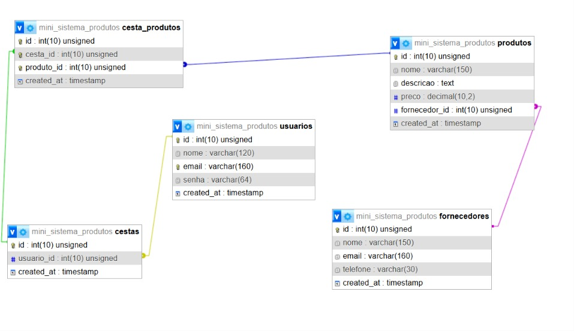

# Mini Sistema de Gestão de Produtos

Projeto acadêmico de um mini sistema de gestão de produtos desenvolvido com **PHP, MySQL, PDO, HTML, CSS, JavaScript e Bootstrap 5**.

## Funcionalidades

- Cadastro e autenticação de usuários.
- Senha armazenada utilizando hash **SHA-256**, conforme requisito do enunciado.
- Cadastro e gerenciamento de fornecedores.
- Cadastro e gerenciamento de produtos.
- Relacionamento entre produtos e fornecedores.
- Cesta vinculada ao usuário autenticado.
- Seleção de produtos por checkbox.
- Validação para exigir pelo menos um produto antes de adicionar à cesta.
- Apenas uma unidade de cada produto.
- Resumo da cesta com quantidade de produtos e valor total.
- Área específica para demonstração de atualizações usando AJAX/Fetch API.
- Criação automática do banco e das tabelas através de `database/setup.php`.

## Tecnologias

- PHP 8.1+ recomendado
- MySQL 8+ / MariaDB compatível
- PDO
- HTML5
- CSS3
- JavaScript (Fetch API)
- Bootstrap 5.3 via CDN

## Instalação no XAMPP

1. Copie a pasta `mini-sistema-produtos` para `C:\xampp\htdocs\`.
2. Inicie **Apache** e **MySQL** no XAMPP.
3. Confira `config/database.php`. O padrão do XAMPP é:
   - host: `localhost`
   - porta: `3306`
   - usuário: `root`
   - senha: vazia
4. Abra no navegador:
   `http://localhost/mini-sistema-produtos/database/setup.php`
5. Após a mensagem de sucesso, acesse:
   `http://localhost/mini-sistema-produtos/`
6. Crie um usuário pela opção **Criar cadastro**.

## Estrutura

```text
mini-sistema-produtos/
├── ajax/
├── assets/
│   ├── css/
│   └── js/
├── classes/
├── config/
├── controllers/
├── database/
├── docs/
├── pages/
├── index.php
├── logout.php
└── README.md
```

## Modelo de dados

As entidades principais são:

- `usuarios`
- `fornecedores`
- `produtos`
- `cestas`
- `cesta_produtos`

### Relacionamentos

```text
USUARIOS 1 ----- N CESTAS
FORNECEDORES 1 ----- N PRODUTOS
CESTAS 1 ----- N CESTA_PRODUTOS N ----- 1 PRODUTOS
```

### DER



## Protótipo Figma


* Login;
* Cadastro de usuário;
* Dashboard;
* Cadastro e gerenciamento de produtos;
* Cadastro e gerenciamento de fornecedores;
* Área de gerenciamento via AJAX;
* Seleção de produtos;
* Cesta de compras.


## AJAX

A página `pages/ajax.php` demonstra operações assíncronas com `fetch()` nos endpoints:

- `ajax/produtos.php`
- `ajax/fornecedores.php`
- `ajax/usuarios.php`
- `ajax/cesta.php`

O cadastro/exclusão é processado sem envio tradicional de formulário e a interface pode ser atualizada sem recarregar a página durante a operação.

## Segurança e boas práticas utilizadas

- PDO com prepared statements.
- Sessão para autenticação.
- `session_regenerate_id(true)` após login.
- Escape de saída com `htmlspecialchars`.
- Chaves estrangeiras para manter integridade relacional.
- Restrição `UNIQUE (cesta_id, produto_id)` para impedir duplicidade do mesmo produto na cesta.

## Observação sobre o enunciado

O algoritmo padronizado utilizado neste projeto é **SHA-256** (`hash('sha256', ...)`).

## Equipe

## Gustavo Luan Cavalini Santos - 60006913
## Pedro Thiago Napoleão - 60007104

## Checklist de entrega

- [x] Protótipos do Figma anexados ao README
- [x] DER exportado e anexado ao README
- [x] Banco e tabelas criados automaticamente
- [x] Cadastro de usuário funcionando
- [x] Login/logout funcionando
- [x] Produtos funcionando
- [x] Fornecedores funcionando
- [x] AJAX funcionando
- [x] Cesta funcionando
- [x] Resumo da cesta funcionando
- [x] Repositório Git atualizado
- [x] Todos os integrantes com commits